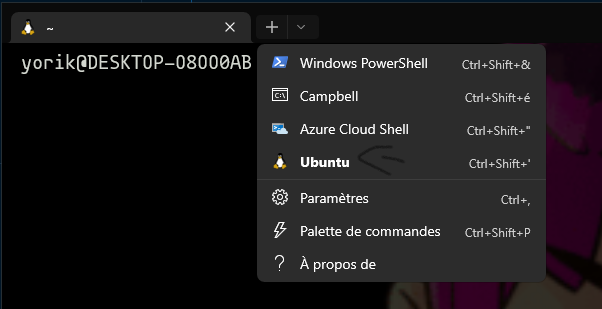

## Vu pendant la réunion

- On a discuté de nos projets pour l'instant Alexia voudrait faire un E-commerce (cosmétique naturel et Bio), Gwladys serait plus branché Etsy pour vendre ses fringues et pourquoi un porteflio...
du coup on pourrait découvrir Wordpress et Drupal.

- introduction à git

- En essayant de se préparer à utiliser git, on a galéré à retrouver nos projets

    === "Chloé et Gwladys"

        Document/Travel

    === "Alexia"

        Document/"Fichiers linux"

- On a découvert les bases de la ligne de commande (cli, commande line interface), sur un système Linux.

    === "Gwladys"

        Raccourcis terminal

    === "Alexia"

        Le terminal est épinglé dans la barre des tâches en bas

    === "Chloé"

        Epinglé à la barre des tâches, (cliquer sur la petit flêche qui permet de choisir type de terminal en l'occurence Ubuntu donc linux)

        

## Prévision

- Prochaine réunion : 05/03/2024 19h00

- On essaiera git et gihtub

## Devoirs

- Créer un compte [github](https://github.com/)