WORK IN PROGRESS

## Installer l'outil Git CLI

Git CLI est un outil en ligne de commande qui permet de gérer les dépôts Git locaux et distants. Il est disponible pour les systèmes d'exploitation les plus courants, notamment Linux, Mac et Windows.

!!! exemple "Installation sur le poste"

    === "Mac M1"
        
        Pour installer Git sur un Mac M1, vous pouvez utiliser Homebrew :
        
        ```bash
        brew install git
        ```

    === "Chromebook"
        
        Sur un Chromebook, vous pouvez installer Git via Linux (Beta) :
        
        ```bash
        sudo apt install git
        ```

    === "Windows 10"
        
        Sur Windows 10, vous pouvez télécharger l'installeur depuis le site officiel de Git : [https://git-scm.com/](https://git-scm.com/)
        
        Une fois téléchargé, lancez l'installeur et suivez les instructions.


## Utilisation de base de Git

Git est un système de contrôle de version qui simplifie la collaboration et le suivi des modifications lors du développement de logiciels.

Nous allons découvrir les concepts fondamentaux à travers la création d'un projet.

TODO git clone / git introduction aux branches

### Création d'un répertoire

Pour commencer, nous allons créer un nouveau répertoire. 

Le système de contrôle de version Git, n'a pas encore enregistré l'existence de ce dossier ni commencé à le suivre.

A ce stade il est impossible d'interagir avec Git, car il n'est pas encore configuré pour suivre les modifications de ce répertoire.

=== "Création d'un répertoire avec la CLI"

    ```bash title="Créer un dossier"
    mkdir new_project
    cd new_project
    ```

=== "Affichage du répertoire dans un explorateur de fichiers"

	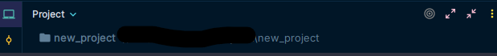


### Initialisation du dépôt Git

Maintenant, nous allons configurer un dépôt Git. 

`git init` est une commande qui initialise un nouveau dépôt Git dans un répertoire existant.

```bash title="Initialiser le suivi avec Git"
git init
```

Cette commande créée un sous-dossier `.git` contenant les informations nécessaires pour suivre les modifications des fichiers du projet.

=== "La création du dépôt GIT est possible grâce à la création du dossier caché .git"

	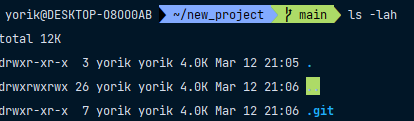

=== "Affichage du dépôt via une interface graphique"	

	Ci-dessous, on peut constater que le répertoire est maintenant suivi par Git, car il contient la mention "master / Ø". 

	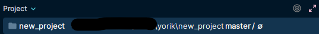

### Vérification de l'état du dépôt

A tout moment, après avoir effectué des modifications dans votre projet (création/modification/suppression de fichiers), vous pouvez vérifier l'état des fichiers en utilisant la commande `git status`. 

Cela vous permettra de voir quels fichiers ont été modifiés, ajoutés à la zone de staging ou encore ceux qui sont déjà prêts à être commités.

```bash title="Vérifier l'état des fichiers"
git status
```

Dans l'exemple ci-dessous, nous pouvons voir que le dépôt est vide et ne contient aucune modification.

=== "Vérification de l'état du dépôt en CLI"

	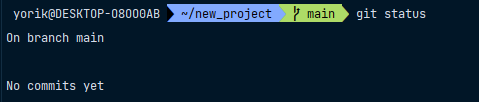

=== "Affichage du dépôt via une interface graphique"

    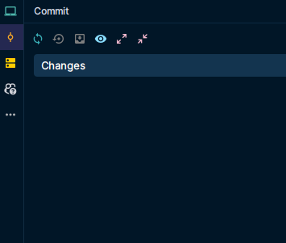

### Staging

Maintenant non allons créer un fichier `README.md`, puis effectuer une nouvelle vérification de l'état du dépôt, pour constater l'intérêt de la commande `git status`.

```bash title="Créer un fichier README.md"
touch README.md
```

Nous pouvons voir que le fichier `README.md` a été créé avec succès...

=== "Vérification de l'existence du fichier README.md"

    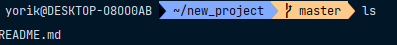

=== "Affichage du dépôt dans un explorateur de fichiers"

    On peut voir que le fichier `README.md` a été créé avec succès et qu'il n'est pas encore suivi par Git, car il apparaît en rouge. 
    
    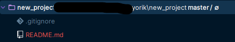

Si on vérifie à nouveau l'état du dépôt

```bash title="Vérifier l'état des fichiers"
git status
```
On constate que le fichier `README.md` est listé comme un nouveau fichier non suivi par Git.

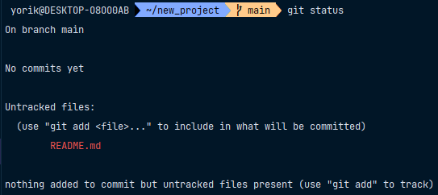

À présent, il est temps d'introduire la notion de staging avec `git add`.

Cette commande permet d'ajouter des fichiers à la zone de staging, préparant ainsi leur inclusion dans le prochain commit.

Le "staging" est une étape intermédiaire dans Git où vous sélectionnez les modifications que vous souhaitez inclure dans votre prochain commit en utilisant la commande git add. Cela vous permet de contrôler précisément les changements que vous enregistrez dans l'historique de version de votre projet.

=== "Staging du fichier README.md en CLI"
    
    ```bash title="Ajout du README.md à la zone de staging"
    git add README.md
    ```

=== "Affichage du dépôt dans un explorateur de fichiers"

    Voici comment effectuer la même action en utilisant l'interface graphique dans le logiciel PHP Storm de la suite Jetbrains.

    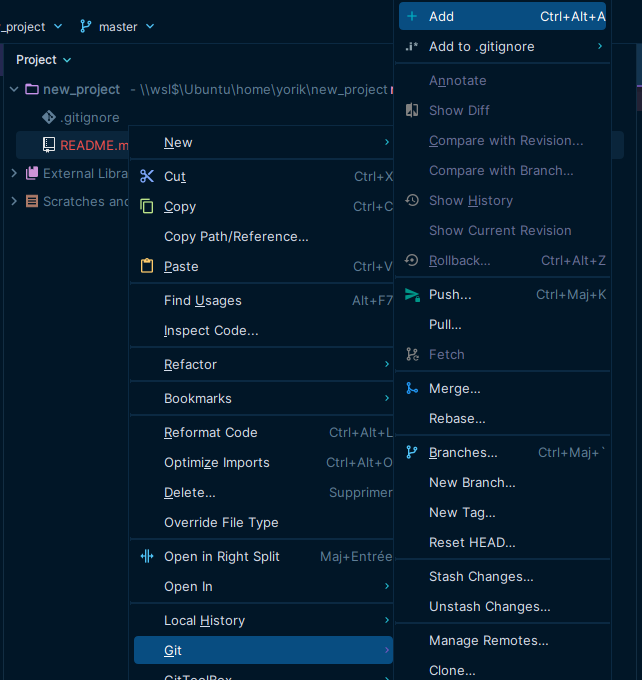


Vérifiez à nouveau l'état du dépôt pour voir que le fichier `README.md` a été ajouté à la zone de staging.

```bash title="Vérifier l'état des fichiers"
git status
```

Ci-dessous, nous pouvons voir que le fichier `README.md` est maintenant listé comme un fichier suivi par Git et prêt à être commité.

=== "Vérification de l'état du dépôt après le staging via la CLI"

    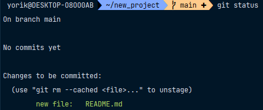

=== "Affichage du dépôt après le staging dans un explorateur de fichiers"

    On peut voir que le fichier `README.md` a été ajouté à la zone de staging, car il apparaît en vert.
    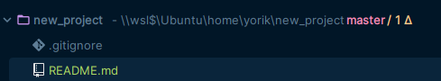


### Création d'un commit

Maintenant que nous avons ajouté le fichier `README.md` à la zone de staging, nous pouvons créer un commit. 

Un commit est une capture instantanée des modifications apportées à un projet à un moment donné.

=== "Création d'un commit en CLI"

    ```bash title="Créer un commit"
    git commit -m "Initial commit"
    ```

=== "Création d'un commit via l'interface graphique"

    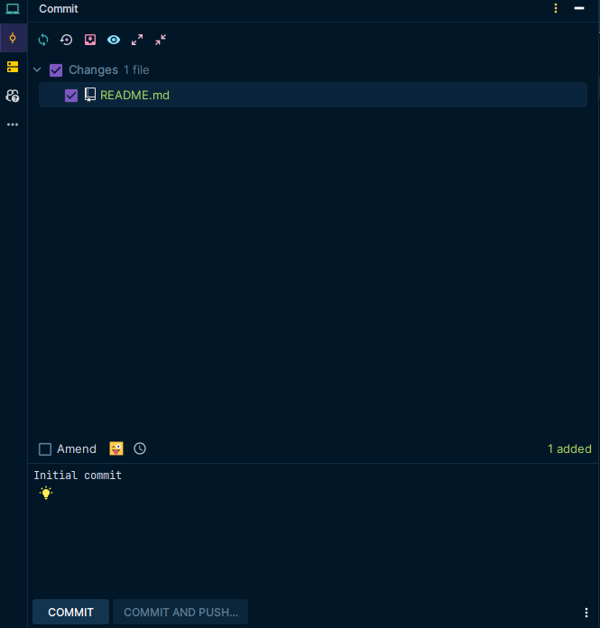


Cela crée un commit avec le message "Initial commit" qui capture l'état actuel du projet. On peut voir que le commit a été créé avec succès.

L'indication « 1 file changed, 0 insertions(+), 0 deletions(-) » est un résumé des changements apportés à un fichier dans un commit Git. Voici ce que chaque partie signifie :

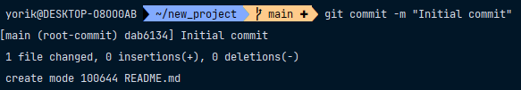

Une fois le commit créé, le fichier `README.md` est retiré de la zone de staging et est maintenant suivi par Git.

Le commit a été ajouté à la branche principale du dépôt, appelée `main`. 

Pour afficher l'historique des commits, vous pouvez utiliser la commande `git log`.

=== "Affichage de l'historique des commits en CLI"

    ```bash title="Afficher l'historique des commits"
    git log
    ```

    Cette commande nous fait entrer dans le journal de l'historique des commits. Pour quitter cet affichage, appuyez sur la touche "Q" de votre clavier.

    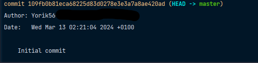


=== "Affichage de l'historique des commits dans un explorateur de fichiers"

    Voici comment afficher l'historique des commits en utilisant l'interface graphique dans le logiciel PHP Storm de la suite Jetbrains.

    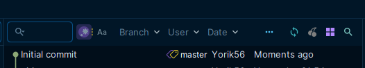


## Connexion à un dépôt distant

Avant de pouvoir pousser notre commit vers un dépôt distant, nous devons d'abord connecter notre dépôt local à un dépôt distant.

Pour ce faire, nous allons utiliser la commande `git remote add origin <url_du_depot>`.

=== "Connexion à un dépôt distant en CLI"

    ```bash title="Connexion à un dépôt distant"
    git remote add origin <url_du_depot>
    ```

## Push et Pull

Une fois que notre dépôt local est connecté à un dépôt distant, nous pouvons pousser notre commit vers le dépôt distant en utilisant la commande `git push`.

=== "Push d'un commit en CLI"

    ```bash title="Pousser un commit vers le dépôt distant"
    git push origin main
    ```
=== "Push d'un commit via l'interface graphique"

    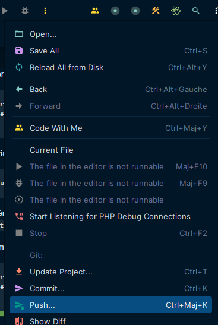


Pour récupérer les dernières modifications du dépôt distant, nous pouvons utiliser la commande `git pull`.

=== "Pull des dernières modifications du dépôt distant en CLI"

    ```bash title="Récupérer les dernières modifications du dépôt distant"
    git pull origin main # Récupérer les dernières modifications du dépôt distant
    ```
=== "Pull des dernières modifications du dépôt distant via l'interface graphique"
  
    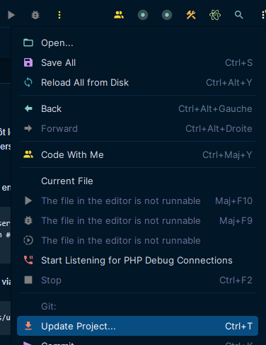


## Création et utilisation de branches

Les branches sont des versions parallèles du code source d'un projet. Elles permettent de travailler sur des fonctionnalités ou des correctifs sans affecter le code principal.

### Création d'une branche

Pour créer une nouvelle branche, nous allons utiliser la commande `git branch`.

=== "Création d'une branche en CLI"

    ```bash title="Créer une nouvelle branche"
    git branch nom_de_la_branche
    ```

=== "Création d'une branche via l'interface graphique"
  
    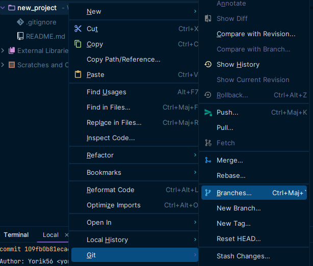

### Changer de branche

Pour changer de branche, nous allons utiliser la commande `git checkout`.

=== "Changer de branche en CLI"

    ```bash title="Changer de branche"
    git checkout nom_de_la_branche
    ```
=== "Changer de branche via l'interface graphique"

    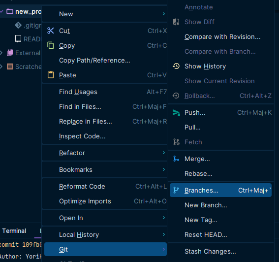


### Affichage des branches

Pour afficher la liste des branches, nous allons utiliser la commande `git branch`.

=== "Affichage des branches en CLI"

    ```bash title="Afficher la liste des branches"
    git branch
    ```

=== "Affichage des branches via l'interface graphique"

    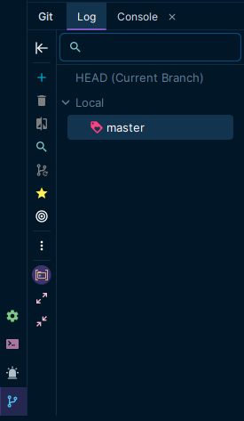


## Fusion de branches

Pour fusionner une branche avec la branche principale, nous allons utiliser la commande `git merge`.

=== "Fusion de branches en CLI"

    ```bash title="Fusionner une branche avec la branche principale"
    git merge nom_de_la_branche
    ```

----------------- 

## Bonnes pratiques

- **Messages de commit significatifs :** Écrire des messages descriptifs pour chaque commit.

- **Fréquence des commits :** Effectuer des commits atomiques et réguliers pour faciliter la gestion des versions.

- **Utilisation de branches temporaires :** Créer des branches temporaires pour expérimenter sans risquer le code principal.

- **Documentation du projet :** Tenir à jour la documentation du projet pour faciliter la collaboration.

## Fonctionnalités avancées

- **Révision de l'historique :** `git log`

- **Gestion des conflits :** À résoudre manuellement après une fusion de branches.

- **Réinitialisation des modifications :** `git reset nom_du_fichier`

- **Rétablissement des modifications :** `git checkout -- nom_du_fichier`

- **Étiquetage des versions :** `git tag nom_de_la_version`


## Ressources supplémentaires

- Documentation officielle : [Git](https://git-scm.com/doc)
