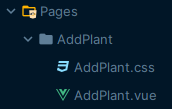

# Guide Tailwind pour TodoLeaf

## Utilisation de Tailwind CSS

Le projet Todoleaf utilise le framework css Tailwind, Préférez donc les classes Tailwind pour le style.

Consultez les classes sur [Cheatsheet Tailwind](https://tailwindcomponents.com/cheatsheet/).

## Styles personnalisés

Dans notre approche de stylisation, nous adoptons en priorité le modèle d'architecture CSS 7-1 pattern. Cette méthode organise le CSS en sept dossiers pour différentes catégories comme la base, les composants, les pages, etc., avec un fichier principal pour les importer tous. Cela facilite la maintenance et l'évolutivité du code. Pour plus de détails sur la mise en œuvre du 7-1 pattern, consultez cette [documentation](https://openclassrooms.com/en/courses/5625786-produce-maintainable-css-with-sass/5723581-use-the-7-1-pattern-for-a-manageable-codebase).

Si Tailwind ou le 7-1 pattern ne couvrent pas un besoin spécifique, utilisez une feuille de style dédiée au niveau de la vue. Nommez les classes personnalisées de manière descriptive et cohérente.

## Mise à jour de la configuration Tailwind
- Pour les besoins récurrents, envisagez d'étendre la configuration de Tailwind via `tailwind.config.js`.

## Bonnes pratiques
- Évitez d'utiliser `!important`.
- Utilisez `@apply` pour appliquer des styles Tailwind au sein des feuilles de style.

## Contribution et mise à jour
- Documentez toute extension ou modification de la configuration de Tailwind pour maintenir la cohérence du projet.
